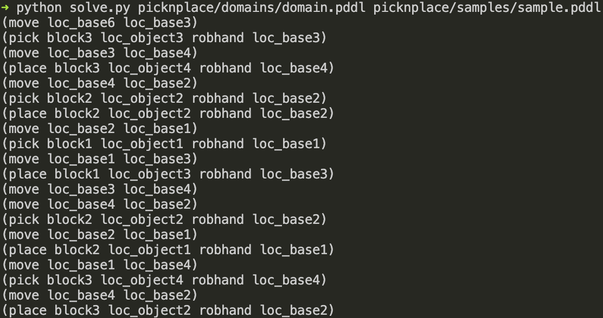

# VKC Task PDDL

   

> This repo is for the IROS 2021 paper "[Efficient Task Planning for Mobile Manipulation: a Virtual Kinematic Chain Perspective](https://zeyuzhang.com/papers/2021-iros-vkc-task/)". This repo only contains the PDDL task planning module, the motion planning part is included in [this](https://github.com/zyjiao4728/VKC-Demo) repo.

# 1. Installation

We have tested this project under Ubuntu 18.04 using Python 3.7. For running this PDDL task planning module, no other dependency is required.


# 2. Usage

**Run the PDDL problem solver**

```bash
python solve.py <domain-file> <problem-file>
```

For example, you can use following command to run an example

```bash
python solve.py picknplace/domains/domain.pddl picknplace/samples/sample.pddl 
```

The example outputs should be




**Generating pick-and-place problems**

You can use [this](gen_exp1_prob.py) scripts to automatically generate a bunch of PDDL pick-and-place problems. More details please refer to the script.


**Run the experiment**

You can use the following command to re-run the experiment 1

```bash
python run_exp1.py <domain-file> <problem-file-dir> <output-dir>
```

For example,

```bash
python run_exp1.py picknplace/domains/domain.pddl picknplace/problems picknplace/results
```

# 3. Bibtex

```text
@inproceedings{jiao2021efficieint,
  title={Efficient Task Planning for Mobile Manipulation: a Virtual Kinematic Chain Perspective},
  author={Jiao, Ziyuan and Zeyu, Zhang and Wang, Weiqi and Han, David and Zhu, Song-Chun and Zhu, Yixin and Liu, Hangxin},
  booktitle={IROS},
  year={2021}
}
```


